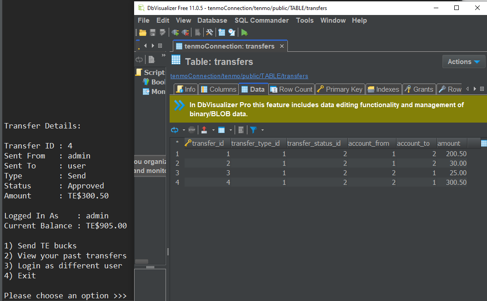

# TEnmo API

## Introduction
A Venmo style money transfer application developed in Java while utilizing pair programming. It connects a client-side CLI to a PostgreSQL database through JDBC using Spring Boot and implements polymorphism, BigDecimal formatting, and integration testing.
## Visuals
